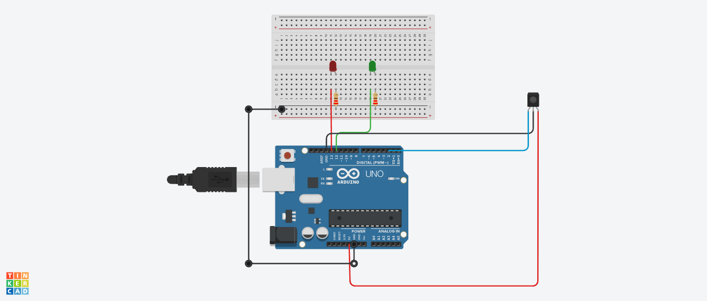

# Sistema de Encendido y Apagado Automático con Sensor IR

Este proyecto utiliza un sensor IR para detectar la presencia de un objeto y controla dos LEDs (verde y rojo) utilizando una placa Arduino. El LED verde se enciende cuando se detecta un objeto y el LED rojo se enciende cuando no se detecta ningun un objeto.

---

## Tabla de Contenidos

1. [Componentes Necesarios](#componentes-necesarios)
2. [Diagrama de Conexión](#diagrama-de-conexión)
3. [Instrucciones de Configuración](#instrucciones-de-configuración)
4. [Funcionamiento](#funcionamiento)

---

## Componentes Necesarios

| Cantidad | Componente                      |
|----------|---------------------------------|
| 1        | Placa Arduino Uno               |
| 1        | Protoboard                      |
| 1        | Sensor IR                       |
| 1        | LED verde                       |
| 1        | LED rojo                        |
| 2        | Resistencias de 220Ω            |
| 7        | Cables de conexión              |

---

## Diagrama de Conexión

---

## Instrucciones de Configuración

1. Conectar el sensor IR y los LEDs con las resistencias a la placa Arduino siguiendo el diagrama de conexión.
2. Subir el código proporcionado a la placa Arduino utilizando el IDE de Arduino.
3. Alimentar la placa Arduino y observar el comportamiento de los LEDs.

---

## Funcionamiento

El código controla dos LEDs (verde y rojo) con el siguiente comportamiento:

1. **Sin objeto detectado**: LED rojo encendido, LED verde apagado.
2. **Objeto detectado**: LED verde encendido, LED rojo apagado.
